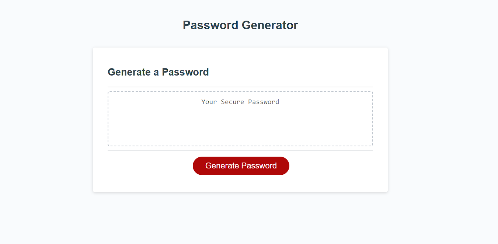

# Password Generator Refactor

## Description
This password gen was not functioning as designed, I added functions to get the password gen to create a password that fits criteria selected by the user. Prompts include password length, uppercase/lowercase letters, numbers, and special characters. Once the user chooses what they want for the password, the randomized password will be generated. 

Follow the link below to access the deployed password generator.

[Password Generator](https://mrbll48.github.io/Password-Gen-Refactor/)
## Screenshot

## Usage
Start by clicking the red generate password button. A prompt will appear asking you to choose how many characters you would like in your password, if you do not choose a character count that fits the criteria an alert will pop up telling you to choose an acceptible length password and the password generate function will end and you have to restart. Once you have chosen the password length you will have to choose if you want numbers, special characters, lower case letters, and/or upper case letters in the password. If you click no to all 4 options you will get an alert that tells you you cannot have an empty password and the generate password function will end. Once you have chosen what characters you would like in your password the randomized password will generate in the box above the generate password button. 

## Credits
Jose Lopez: Program tutor
Erik Hirsch: Program TA

## License
MIT

---
